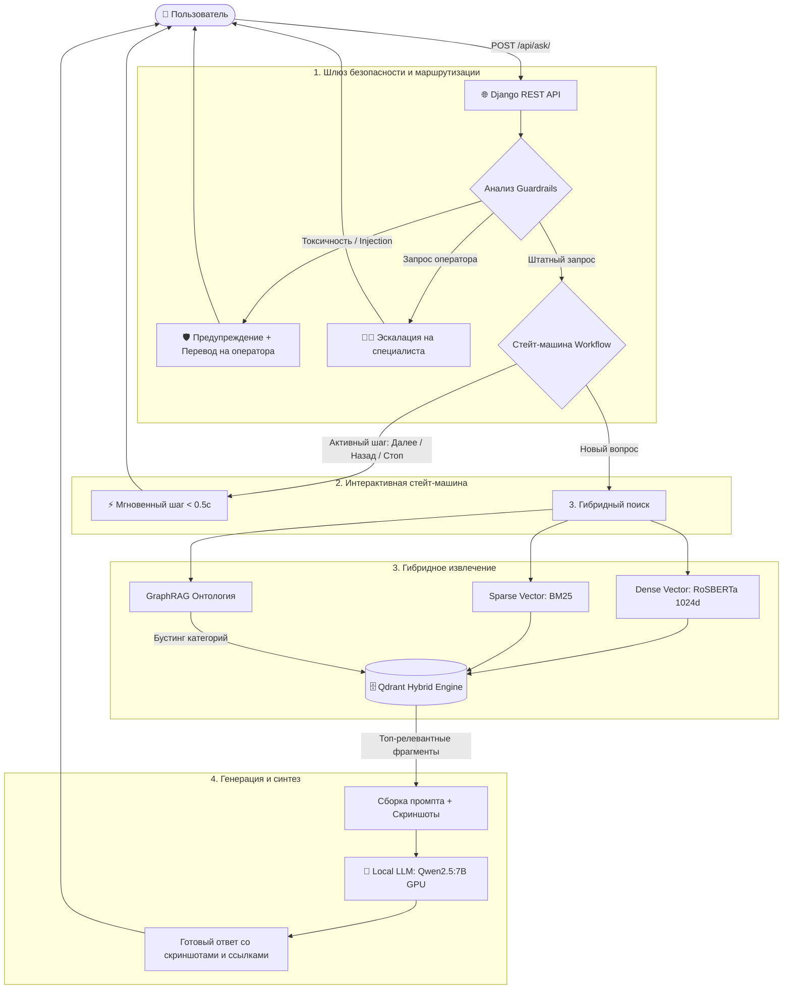

# 🏆 RLT.Tender_Guide — Интеллектуальная Агентная RAG-Система Поддержки Поставщиков

[](https://python.org)
[](https://djangoproject.com)
[](https://qdrant.tech)
[](https://pytorch.org)
[](https://ollama.ai)
[](https://docker.com)
[](#-результаты-агентного-qa-тестирования)

> **RLT.Tender_Guide** — это промышленная вопросно-ответная система на базе гибридной архитектуры **RAG (Retrieval-Augmented Generation)**, **графовой онтологии (GraphRAG)** и **интерактивных стейт-машин (Agentic Workflows)**. Система разработана для автоматизации технической, юридической и регламентной поддержки участников закупок на **Портале Поставщиков Москвы (zakupki.mos.ru)** и федеральных площадках (44-ФЗ, 223-ФЗ).

---

## ⚡ Ключевые возможности

- 🔍 **Гибридный поиск (Hybrid RAG):** Одновременное ранжирование плотных семантических векторов (**ai-forever/ru-en-RoSBERTa**, 1024 dim) и разреженных лексических представлений (**Qdrant/BM25**) с нормализацией Reciprocal Rank Fusion (RRF).
- 🕸 **Онтологический GraphRAG:** Граф связей предметной области госзакупок (`PROCUREMENT_KNOWLEDGE_GRAPH`), динамически повышающий релевантность смежных сущностей (ФАС ↔ 44-ФЗ ↔ Сроки обжалования; ЭЦП ↔ КриптоПро ↔ Браузерные плагины).
- 🔄 **Интерактивные сценарии (Stateful Agentic Workflows):** Автоматическое распознавание необходимости пошагового руководства («Да» / «Далее» / «Назад» / «Готово») с мгновенным откликом (**< 0.5 сек**) и сохранением контекста в БД.
- 🛡 **Многоуровневые Guardrails:** Предотвращение Prompt Injection и моментальная фильтрация обсценной лексики и агрессии с защитой от транслита и разделения символов точками/пробелами.
- 👨‍💻 **Бесшовная эскалация (Human-in-the-Loop):** Автоматическая передача диалога дежурному специалисту (`transfer_to_support`) при явном запросе пользователя или детекции неразрешимой коллизии.
- 🚀 **One-Click Deploy (Автоинициализация):** Полный запуск из коробки без ручных действий — проверка сервисов, загрузка моделей, накат миграций, автоиндексация Qdrant и прогрев GPU.

---

## 🏗 Архитектура системы



---

## 🚀 Запуск Kafka RAG-сервиса

Нужны Docker с Compose >= 2.20 и отдельная Ollama с установленной моделью.
Поддерживаются Linux и Docker Desktop на macOS/Windows. RAG-образ использует
Python 3.12 и CPU PyTorch; NVIDIA runtime для него не требуется.

```bash
docker compose up -d --build
docker compose logs -f rag
```

Compose запускает Kafka, Redis, Qdrant и самостоятельный FastStream worker.
Django и автоматическая переиндексация при старте не запускаются.
Темы Kafka задаются в `.env`; они должны совпадать с основным приложением.
Данные Qdrant и кэш моделей сохраняются в именованных томах.

Настройка Ollama, локальной модели, внешнего Kafka и диагностика сборки:
[инструкция запуска](docs/docker_run.md).

---

## 📊 Результаты агентного QA-тестирования

Система была подвергнута комплексному тестированию с помощью встроенного автономного фреймворка `scripts/agentic_qa_tester.py`. Проведены тесты 5 реалистичных персон и стресс-тест под параллельной нагрузкой.

| Персона / Сценарий | Количество шагов | Средняя задержка | Особенности сценария | Результат |
| :--- | :--- | :--- | :--- | :--- |
| **1. Новичок-поставщик** | 3 диалоговых шага | 19.44 с | Регистрация, КЭП/ЭЦП, ЕРУЗ/ЕИС | ✅ **100% PASS** |
| **2. Юрист по 44-ФЗ (Workflow)** | 6 диалоговых шагов | **0.44 с** (шаги) | Обжалование в ФАС, активация, шаг назад, завершение | ✅ **100% PASS** |
| **3. Техспециалист** | 2 диалоговых шага | 19.65 с | Плагин КриптоПро в браузере, подписание УПД | ✅ **100% PASS** |
| **4. Провокатор / Токсик** | 4 диалоговых шага | **0.51 с** (эскалация) | Маскированный мат, Prompt Injection, эскалация | ✅ **100% PASS** |
| **5. Нагрузочный стресс-тест** | 5 параллельных потоков | 31.97 с | Конкурентный доступ, стабильность GPU VRAM | ✅ **100% PASS** |

### Итоговые SLA показатели:
- **Общий Success Rate:** **`100.0%`**
- **Минимальная задержка (Fast-Path):** **`0.413 с`**
- **Потребление видеопамяти (VRAM):** **6.6 ГБ** (в пределах 8 ГБ карты RTX 3050)
- **Утечки памяти / OOM:** **`0 событий`**

---

## 🔌 Спецификация REST API

### Эндпоинт: `POST /api/ask/`

#### Запрос:
```json
{
  "question": "Как подать жалобу в ФАС по 44-ФЗ?",
  "chat_id": "09f1694c-3bf5-4b1b-8152-5c514e260182",
  "user_id": "c4b14e26-3bf5-4b1b-8152-09f1694c0182"
}
```

#### Ответ (RAG со скриншотом):
```json
{
  "answer": "### Подача жалобы в ФАС по 44-ФЗ:\n\n1. Авторизуйтесь в ЕИС...\n\n",
  "citations": [
    {
      "source": "Регламент обжалования 44-ФЗ (Статья 105)",
      "url": "https://zakupki.mos.ru/help/article/105"
    }
  ],
  "images": [
    "/media/images/fas_step1.png"
  ],
  "line_info": {
    "line": "FIRST_LINE",
    "name": "Первая линия поддержки (RAG + Граф)",
    "badge_color": "#16a34a"
  },
  "ids": {
    "user": "c4b14e26-3bf5-4b1b-8152-09f1694c0182",
    "chat": "09f1694c-3bf5-4b1b-8152-5c514e260182",
    "question_message": "...",
    "answer_message": "..."
  }
}
```

---

## 📁 Структура репозитория

```text
.
├── docker-compose.yml           # Конфигурация мультиконтейнерного стека (Django + Qdrant + GPU)
├── Dockerfile                   # Оптимизированный Dockerfile с CUDA и Python 3.10
├── entrypoint.sh                # Точка входа контейнера с запуском auto_init
├── requirements.txt             # Зафиксированные стабильные зависимости
├── README.md                    # Главная документация проекта
├── RLT_Tender_Guide_Book.pdf    # 📖 Полная PDF-книга об архитектуре и реализации
├── dataset/                     # Датасет базы знаний
│   ├── 1_legislation/           # Законодательная база (44-ФЗ, 223-ФЗ, Гражданский кодекс)
│   ├── 2_instructions/          # Официальные инструкции Портала Поставщиков Москвы
│   └── images/                  # Локальные скриншоты интерфейса
├── docs/                        # Инженерная документация
│   ├── agentic_qa_report.md     # Полный отчет QA-тестирования
│   ├── rlt_tender_guide_handbook.md # Исходный текст книги в Markdown
│   └── task_*.md                # Технические задания и спецификации
├── logs/                        # Логи и метрики
│   ├── agentic_qa_metrics.json  # Метрики тестов в машинночитаемом формате
│   └── feedback_log.jsonl       # Логи обратной связи пользователей
├── scripts/                     # Вспомогательные и тестовые скрипты
│   ├── agentic_qa_tester.py     # Агентный комплекс нагрузочного и функционального QA
│   └── generate_book_pdf.py     # Генератор PDF-книги через ReportLab
└── RLT_project/                 # Исходный код Django-приложения
    ├── manage.py                # Утилита управления Django
    ├── auto_init.py             # Скрипт One-Click инициализации, автоиндексации и warmup
    ├── chat/                    # Модели чатов, сообщений и сессий
    └── rag/                     # Ядро RAG-пайплайна
        ├── main_rag.py          # Синтез ответов и вызов LLM
        ├── router.py            # Guardrails, маршрутизация линий и стейт-машина
        ├── search.py            # Гибридный поиск и Reciprocal Rank Fusion
        ├── graph_rag.py         # Онтологический граф госзакупок
        └── views.py             # REST API эндпоинты
```

---

## 📖 Техническая книга проекта

Для детального погружения в архитектурные решения, математику ранжирования, управление видеопамятью и опыт решения проблем с производительностью сгенерирована полноценная книга в стиле издательств O'Reilly и Manning:
- **Файл книги:** `RLT_Tender_Guide_Book.pdf` (в корневом каталоге репозитория).
- **Исходный текст:** `docs/rlt_tender_guide_handbook.md`.

---

## 👥 Команда разработки и лицензия
Разработано в рамках хакатона РЛТ командой **RLT.Tender_Guide**.
Лицензия: **MIT License**.