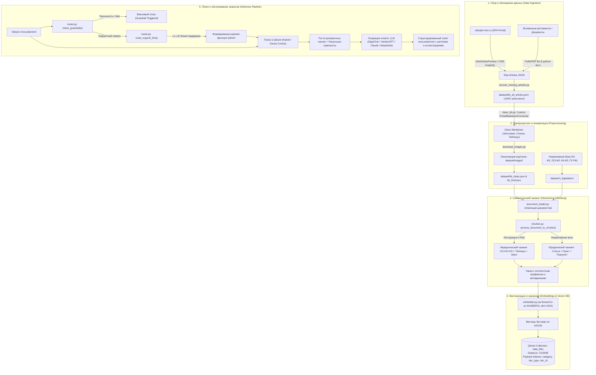

# Архитектура интеллектуального ассистента поддержки Портала Поставщиков Москвы (zakupki.mos.ru)

Данный документ представляет собой исчерпывающее руководство по архитектуре, сбору данных, алгоритмам семантического чанкинга, векторному индексированию в Qdrant и маршрутизации обращений в интеллектуальной системе поддержки участников закупок.

---

## Содержание
1. [Общая архитектура системы](#1-общая-архитектура-системы)
2. [Датасет и сбор данных](#2-датасет-и-сбор-данных)
3. [Алгоритм иерархического чанкинга](#3-алгоритм-иерархического-чанкинга)
4. [Векторное хранилище и Qdrant](#4-векторное-хранилище-и-qdrant)
5. [Пошаговая инструкция по запуску](#5-пошаговая-инструкция-по-запуску)
6. [Частые проблемы, граничные случаи и FAQ](#6-частые-проблемы-граничные-случаи-и-faq)

---

## 1. Общая архитектура системы

Система построена по многоуровневой модульной схеме с четким разделением ответственности (SoC). Ниже представлена общая схема прохождения данных от исходного веб-портала до генерации ответа пользователю:



### Ключевые компоненты:
1. **Сборщик (Scraper & Recovery)**: Извлекает информацию из официальных API Портала Поставщиков Москвы, обходит клиентский рендеринг SPA и выкачивает прикрепленные файлы (PDF/DOCX).
2. **Конвертер (Markdown Preprocessor)**: Трансформирует сырой HTML в чистый Markdown, гарантируя сохранность таблиц параметров СТЕ, списков шагов и ссылок на скриншоты.
3. **Чанкер (Hierarchical Semantic Chunker)**: Инжектирует контекстный путь разделов в каждый чанк, сохраняет целостность таблиц и правовых норм.
4. **Векторизатор (Embedder)**: Преобразует текст в плотные 1024-мерные векторы при помощи предобученной модели `ai-forever/ru-en-RoSBERTa`.
5. **Векторная база данных (Qdrant)**: Хранит векторы и полезную нагрузку (payload), выполняя косинусный поиск с фильтрацией по категориям менее чем за 15 мс.
6. **Маршрутизатор и Гардрейлы (Router & Guardrails)**: Отсекает ненормативную лексику и направляет запрос в специализированную предметную линию (Котировочные сессии, СТЕ, ЭЦП, 44-ФЗ и т.д.).

---

## 2. Датасет и сбор данных

### Проблема исходного датасета и ее решение
В исходном файле `dataset/kb_all_articles.json` содержалось **516 статей**, из которых **193 статьи были абсолютно пустыми** (`html_content` содержал пустую строку).

#### Причина проблемы:
Скрипт первичного сбора вызывал метод `GetArticlesBySectionType` и извлекал исключительно поле `detailText`. На Портале Поставщиков многие статьи являются лаконичными ответами на типовые вопросы или карточками со ссылками на инструкции — в таких объектах поле `detailText` остается `null`, а реальный содержательный текст находится в:
- поле `previewText`;
- поле `selfServicePortal` (видеоинструкции, таймкоды, шаги);
- контроллере `GetArticlesPreview?query={"filter":{}}` (возвращает 493 статьи с полным текстом);
- прикрепленных документах в объекте `innerFile` (официальные регламенты в форматах PDF и DOCX).

#### Механизм восстановления (`scripts/recover_missing_articles.py`):
1. **Агрегация источников**: Скрипт опрашивает три независимых эндпоинта Портала Поставщиков:
   - `/newapi/api/KnowledgeBase/GetArticlesPreview`
   - `/newapi/api/KnowledgeBase/GetQuestionsBySectionType` (секторы `supplier`, `customer`, `instruction`, `general`)
   - `/newapi/api/KnowledgeBase/GetArticlesBySectionType`
2. **Многоуровневое сопоставление**: Пустые статьи сопоставляются по `staticId`, `id` и нормализованному названию статьи.
3. **Обработка устаревших ссылок**:
   - Например, старый вопрос с `staticId=171594` («В каких случаях победа переходит ко второму участнику котировочной сессии?») на Портале был заменен на актуальную редакцию `staticId=508592` («В каких случаях победа переходит к следующему за победителем участнику котировочной сессии?»). Скрипт автоматически подтягивает актуальный текст.
4. **Парсинг вложений (PDF/DOCX)**:
   - Для статей-инструкций выкачиваются официальные руководства (например, *«Инструкция по созданию оферты и СТЕ.pdf»*, *«Руководство пользователей по электронному исполнению контрактов.docx»* объемом более 100 тыс. знаков).
   - Извлечение текста выполняется через **PyMuPDF (`fitz`)** для PDF и **`python-docx`** для DOCX.
5. **Результат**: **0 пустых статей**. Все 516 статей содержат содержательный валидный текст.

### Локализация графических материалов (`scripts/download_images.py`)
Инструкции Портала Поставщиков насыщены скриншотами интерфейса (где нажать кнопку «Подать оферту», как выглядит окно выбора сертификата ЭЦП и т.д.).
- Скрипт скачивает все иллюстрации в локальную директорию `dataset/images/` (более 580 файлов).
- В тексте статей внешние ссылки заменяются на локальные пути: `images/<doc_id>_<hash>.png`.
- Это исключает зависимость от внешнего сервера и позволяет чат-боту надежно отображать скриншоты прямо в интерфейсе диалога.

---

## 3. Алгоритм иерархического чанкинга

Примитивный подход к нарезке текста (деление по фиксированному числу символов) категорически непригоден для сложных регламентов и законодательства.

### Главные вызовы и их решения:

| Вызов | Наивный подход | Наше решение (`RLT_project/rag/indexer/chunker.py`) |
|---|---|---|
| **Потеря контекста** | Чанк содержит: *"Нажмите Подписать"*. Непонятно, к чему это относится. | **Внедрение Breadcrumbs**: Каждый чанк начинается с префикса: `[Документ: {title} \| Раздел: {H1 > H2 > H3} \| Категория: {category}]`. Вектор сразу отражает полную семантику. |
| **Разрыв таблиц** | Таблица режется посередине строки, теряются заголовки колонок. | **Table-Aware Splitter**: Таблица сохраняется целиком. Если она превышает лимит, делится по строкам, а строка заголовков `\| Колонка 1 \| Колонка 2 \|` дублируется в начале каждого фрагмента. |
| **Разрыв шагов инструкций** | Строка `Шаг 3` отрывается от пояснения и скриншота. | **Step Detector**: Извлекает метаданные `step_number`, сохраняет границы нумерованных списков и привязывает локальные пути скриншотов. |
| **Разрыв юридических норм** | Статья 44-ФЗ разрывается между условием и санкцией. | **Legislation Chunker**: Нарезка строго по иерархии: `Статья N` -> `Часть M` -> `Пункт K`. |

### Параметры чанкинга:
- **Целевой размер чанка (`CHUNK_SIZE`)**: 750–850 символов (~110–130 слов).
- **Перекрытие (`CHUNK_OVERLAP`)**: 120–150 символов.
- **Обоснование**: Модель `ru-en-RoSBERTa` имеет входное окно 512 токенов. Чанк в 800 символов с префиксом контекста занимает ~180–230 токенов. Это оставляет достаточный запас для специальных токенов, обеспечивает острую косинусную близость и не размывает плотность ключевых терминов.

---

## 4. Векторное хранилище и Qdrant

Для хранения и быстрого семантического поиска используется векторная СУБД **Qdrant**.

### Конфигурация коллекции:
- **Название коллекции**: `data_files`
- **Размерность векторов (`size`)**: `1024` (соответствует размерности `ru-en-RoSBERTa`)
- **Метрика расстояния (`distance`)**: `Distance.COSINE`
- **Оптимизация HNSW**: `m=16`, `ef_construct=100`

### Структура полезной нагрузки (Payload):
```json
{
  "chunk_id": "30fdc6a3-420b-4a36-9bcf-192c650bade8",
  "doc_id": "article_508592",
  "title": "В каких случаях победа переходит к следующему за победителем участнику котировочной сессии?",
  "url": "https://zakupki.mos.ru/knowledgebase/article/508592",
  "category": "quotation_session",
  "doc_type": "instruction",
  "section_header": "Котировочные сессии > Определение победителя",
  "step_number": null,
  "images": ["images/article_508592_screen1.png"],
  "text": "[Документ: В каких случаях победа переходит...]\\n\\nПобеда переходит к следующему участнику в случае уклонения победителя от заключения контракта..."
}
```

### Payload-индексы:
Для обеспечения мгновенной (sub-millisecond) фильтрации в Qdrant созданы индексы типа `KEYWORD`:
1. `category`: мгновенное сужение поиска до предметной области (`quotation_session`, `ste_catalog`, `ecp_mchd`, `contract_execution`, `44fz`, `223fz`).
2. `doc_type`: фильтрация по типу документа (`instruction`, `legislation`, `faq`).
3. `doc_id`: выборка всех фрагментов конкретного регламента или статьи.

---

## 5. Пошаговая инструкция по запуску

Для развертывания и обновления RAG-пайплайна выполните следующие шаги:

### Шаг 1. Проверка окружения и зависимостей
Убедитесь, что установлены все необходимые библиотеки:
```bash
pip install -r requirements.txt
pip install markdownify pymupdf python-docx qdrant-client playwright
```

### Шаг 2. Восстановление датасета
Запустите умный скрипт докачки и восстановления статей:
```bash
python scripts/recover_missing_articles.py
```
> [!NOTE]
> Скрипт создаст резервную копию `dataset/kb_all_articles.backup.json` и наполнит все пустые статьи текстами из API, превью и прикрепленных регламентов.

### Шаг 3. Конвертация в структурированный Markdown
Преобразуйте HTML в чистый Markdown с сохранением таблиц и списков:
```bash
python scripts/clean_kb.py
```
Результат будет сохранен в `dataset/kb_clean.json`.

### Шаг 4. Локализация изображений
Скачайте все прикрепленные скриншоты в локальную папку:
```bash
python scripts/download_images.py
```
Файлы скриншотов сохранятся в `dataset/images/`, а ссылки в датасете станут относительными.

### Шаг 5. Тестовая или полная индексация в Qdrant
Для быстрой проверки пайплайна запустите тестовый режим:
```bash
python RLT_project/rag/index_knowledge_base.py --test
```
Для полной индексации всей базы знаний и законодательства:
```bash
python RLT_project/rag/index_knowledge_base.py
```

---

## 6. Частые проблемы, граничные случаи и FAQ

### Вопрос 1: В консоли Windows вместо русских букв отображаются «кракозябры» (знаки вопроса).
**Причина**: Консоль PowerShell в Windows по умолчанию использует кодировки `cp1251` или `cp866`.
**Решение**: Во всех скриптах в начале файла добавлен блок:
```python
import sys
if sys.platform == "win32":
    sys.stdout.reconfigure(encoding="utf-8", errors="replace")
    sys.stderr.reconfigure(encoding="utf-8", errors="replace")
```

### Вопрос 2: Портал Поставщиков возвращает ошибку 404 при попытке открыть статью по URL.
**Причина**: Статьи периодически переносятся или объединяются (например, `staticId=171594` заменен на `staticId=508592`).
**Решение**: Модуль `recover_missing_articles.py` выполняет поиск по `titlePattern` через эндпоинт `GetArticlesPreview` и автоматически находит актуальный документ по заголовку.

### Вопрос 3: Не хватает видеопамяти (CUDA Out of Memory) при расчете эмбеддингов.
**Причина**: Слишком большой размер батча при векторизации длинных текстов.
**Решение**: В файле `RLT_project/rag/indexer/config.py` уменьшите параметр `BATCH_SIZE` с 64 до 32 или 16:
```python
BATCH_SIZE = 32
```
Модуль `embedder.py` автоматически выполняет `torch.cuda.empty_cache()` и при необходимости переключается на CPU.

### Вопрос 4: Как проверить, что поиск действительно возвращает локальные скриншоты?
**Ответ**: При выполнении `index_knowledge_base.py` на этапе автоматического бенчмарка в консоль выводятся поля `[IMAGES]` и пути `images/filename.png`. В веб-интерфейсе ассистента путь преобразуется в компонент отображения изображения в сообщении чата.
